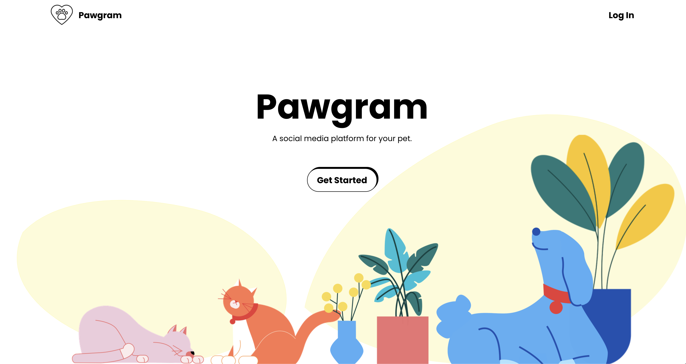

# Pawgram

_A social media platform for your pets._

## Introduction

For my final project at the Concordia Bootcamp, my goal was to create a full-stack web application using **React**, **Node.js**, **MongoDB**, and **Express**. I also used **Figma** to design my application beforehand.

## Concept

With rising fame of social media platforms, I decided to take inspiration of Instagram and create an app for pet pictures and name it **Pawgram**.

## APIs

The APIs that I used are used to get general information about the Dog or Cat's breed, and random facts about them.

- [Random Dog Fact](https://github.com/DukeNgn/Dog-facts-API)
- [Dog Breed Info](https://thedogapi.com/)
- [Random Cat Fact](https://catfact.ninja/)
- [Cat Breed Info](https://thecatapi.com/)

## Run-through

[Demo](https://www.youtube.com/watch?v=sGchwurvjVg&t=2s&ab_channel=jeejimon)

All illustrations are from the amazing artist [Mariana Gonzalez Vega](https://blush.design/collections/40G09koP55fYh86yZDnX/stuck-at-home).

For both the `client` and the `server` folders do a `yarn install` and a `yarn start`

### 1. Homepage

### 2. Sign Up, Sign In

I used **JWT** for authentication. Using local storage, I store the token once logging into a profile, and remove it once logged out.

### 3. Profile/Pets Page

- Each user can add their pets, including a profile picture. Once they select the type of pet, there is a list of all the breeds generated by the Cat/Dog API.
- User can edit/remove their pet.

### 4. Friends Page

- Using the search bar, the user can find other profiles. Once they've added a friend, they can send them play date invites.

### 5. Inbox Page

- The Inbox is divided into 2 sections: playdates and messages. Once you accept the play date, it goes into the play date inbox. All unread and refused playdates stay in the messages inbox.

### 6. Album Page

- You can add pictures of your pet. Other users can "paw" the picture and comment on it.

### Note

- The website is also responsive :)
